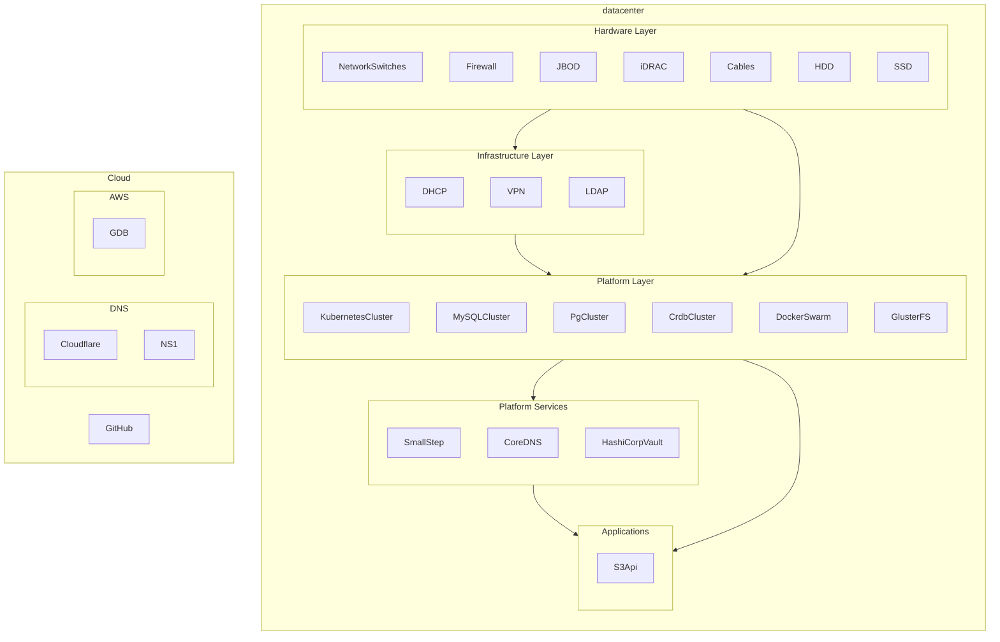

# Operational Readiness

## Layers

### Service Operation Readiness

> For layer 4 & layer 5 services

#### Stage 1: Proof-of-concept

- [ ] Application is deployed into Alpha.
- [ ] Application has a set of standalone artifacts. (Containers, Helm charts, Terraform Modules, Ansible Modules, ...)
- [ ] Application is accessible by Wasabi Engineers from the VPN and from Wasabi Services in the environment.

#### Stage 2: Unstable

- [ ] Application is deployed into Beta.
- [ ] Application uses TLS to encrypt all network traffic (HTTPS, SSH, gRPC, ...)
  > Apps allowed to use self-signed certs
- [ ] Applications have scripts, tooling, and/or a guide to upgrade to newer versions.
  > Must be specific to Wasabi's instance (no linking to general docs/guides)
- [ ] Applications have documentation on the architecture of the application.
- [ ] Applications have a living troubleshooting guide for common issues.
- [ ] Application is sending metrics to Prometheus.

#### Stage 3: Release-ready

> Applications at this level should be able to provide:
>
> - Data Integrity SLA of 1 week prior to the start of the incident.
> - Data Retention SLA of 30 days from present.

- [ ] Application is deployed into Production.
- [ ] Application is a registered service in PagerDuty.
- [ ] Applications have automated backups to external storage.
- [ ] Applications have Disaster Recovery scripts, tooling, and a guide.
- [ ] Applications have a Bootstrapping scripts, tooling, and a guide.
  > Must be separate from disaster recovery
- [ ] Applications are using Wasabi CA's to sign/issue all TLS Certificates.
- [ ] Every container has resource requests for: CPU & Mem

#### Stage 4: High Availability

> Applications at this level should be able to provide:
>
> - Network Uptime SLA of 12 hours since start of the incident.
> - Data Integrity SLA of 24 hours prior to the start of the incident.
> - Data Retention SLA of 90 days from present.

- [ ] Applications have automation/tooling to deploy from a snapshot.
- [ ] Each service in the application is replicated at least 3 times.
- [ ] Every container has resource limits for: CPU & Mem
- [ ] Applications are FIPS-enabled and only use FIPS 104-2 ciphers for network traffic.

#### Stage 5: Autopilot

> Applications at this level should be able to provide:
>
> - Network Uptime SLA of 2 hours since start of the incident.
> - Data Integrity SLA of 8 hours prior to the start of the incident.
> - Data Retention SLA of 365 days from present.
