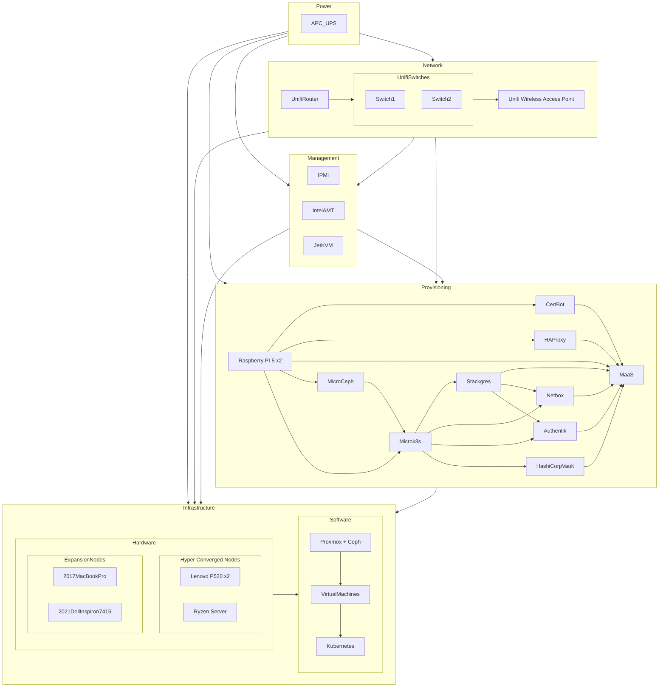

<!-- TODO: use documentation generation to manage this file -->

# Homelab

Hi there! This is my homelab where I try out new technologies, run home services, & play games with.

## Architecture

### Homelab

```mermaid
flowchart TD
    subgraph Power
        APC_UPS
    end

    subgraph Network
        UnifiRouter --> UnifiSwitches --> UnifiAP
        subgraph UnifiSwitches
            Switch1
            Switch2
        end
        UnifiAP["Unifi Wireless Access Point"]
    end

    subgraph Management
        IPMI
        IntelAMT
        JetKVM
    end

    subgraph Provisioning
        RaspberryPI5["Raspberry PI 5 x2"] --> CertBot & HAProxy & MaaS & MicroCeph & Microk8s
        MicroCeph --> Microk8s --> Stackgres & Netbox & Authentik & HashiCorpVault --> MaaS
        Stackgres --> Netbox & Authentik
        HAProxy & CertBot --> MaaS
    end

    subgraph Infrastructure
        subgraph Hardware
            subgraph HCI["Hyper Converged Nodes"]
                LenovoP520["Lenovo P520 x2"]
                Ryzen4Server["Ryzen Server"]
            end

            subgraph ExpansionNodes
                2017MacBookPro
                2021DellInspiron7415
            end
        end

        subgraph Software
            Proxmox["Proxmox + Ceph"]
            Kubernetes
            VirtualMachines

            Proxmox --> VirtualMachines --> Kubernetes
        end

        Hardware --> Software
    end

    Power --> Network
    Power & Network --> Management
    Power & Network & Management --> Provisioning
    Power & Network & Management & Provisioning --> Infrastructure
```

## Terraform Organization

> Feel free to checkout any of the following directories for more information about the terraform workspaces & modules that bring it all together.

> Each terraform workspace / module has documentation generated by terraform-docs that shows a rough idea of what is going on.

Terraform workspaces are located in [infra/](infra/)

Terraform modules are either in:

- The top-level [modules/](modules/) directory
  > if the module can be used across different terraform workspaces
- As subfolders within an existing terraform workspace in [infra/](infra/)
  > if the module is non-portable and only meant to organize code within a single workspace

Terraform workspaces / modules:

<!-- This list is generated from the following nushell script -->
<!-- glob ./**/*.tf | path dirname | uniq | each {|| $in | path relative-to (pwd) } | each {|| $"[($in)]\(($in)\)"} | to yaml | str replace --all "'" "" -->
<!-- TODO: automatically generate this list via ./format.nu -->

- [infra/proxmox/terraform](infra/proxmox/terraform)
- [infra/proxmox/terraform/modules/proxmox_cloudinit_vm](infra/proxmox/terraform/modules/proxmox_cloudinit_vm)
- [infra/proxmox/terraform/modules/proxmox_cloudinit_vm/modules/unifi_host_dns_records](infra/proxmox/terraform/modules/proxmox_cloudinit_vm/modules/unifi_host_dns_records)
- [infra/k8s/digitalocean/terraform](infra/k8s/digitalocean/terraform)
- [infra/k8s/homezone/terraform](infra/k8s/homezone/terraform)
- [infra/k8s/homezone/terraform/modules/rook_ceph](infra/k8s/homezone/terraform/modules/rook_ceph)
- [infra/k8s/homezone/terraform/modules/cluster_operators](infra/k8s/homezone/terraform/modules/cluster_operators)
- [infra/k8s/homezone/terraform/modules/monitoring_stack](infra/k8s/homezone/terraform/modules/monitoring_stack)
- [infra/k8s/homezone/terraform/modules/cilium](infra/k8s/homezone/terraform/modules/cilium)
- [infra/k8s/homezone/terraform/modules/cluster_services](infra/k8s/homezone/terraform/modules/cluster_services)
- [infra/secrets/terraform](infra/secrets/terraform)
- [infra/secrets/terraform/modules/proxmox_secrets](infra/secrets/terraform/modules/proxmox_secrets)
- [infra/secrets/terraform/modules/tfe_secrets](infra/secrets/terraform/modules/tfe_secrets)
- [infra/secrets/terraform/modules/gh_secrets](infra/secrets/terraform/modules/gh_secrets)
- [infra/digitalocean/terraform](infra/digitalocean/terraform)
- [infra/digitalocean/nyc3/terraform](infra/digitalocean/nyc3/terraform)
- [infra/tfcloud/terraform](infra/tfcloud/terraform)
- [infra/unifi/terraform](infra/unifi/terraform)
- [infra/tailscale/terraform](infra/tailscale/terraform)
